<h1 align="center">
  
</h1>

  <em>Full Stack Engineer with 4+ years of experience building production-grade frontend applications and scalable backend systems in fintech and SaaS environments</em>

  
  

  
  
  

---

## About Me

I'm a Full Stack Engineer focused on building enterprise frontend platforms and scalable backend systems. I've built an enterprise frontend platform from the ground up using React, delivering complex data-rich dashboards and interactive interfaces for financial workflows. Deep backend expertise in Python, data pipelines, and distributed systems processing millions of records daily.

- **Current Role:** Software Engineer at FlexTrade, building the FlexData analytics platform
- **Focus:** Production-grade React applications, real-time data visualization, high-throughput ELT pipelines
- **Education:** B.Tech, Engineering Physics — IIT Hyderabad (2022)
- **Philosophy:** Passionate about translating complex domain problems into intuitive, high-performance user experiences

---

  

---

## Technical Skills

### **Frontend**

### **Backend & APIs**

### **Data Engineering**

### **Databases**

### **Cloud & DevOps**

### **Monitoring & Observability**

---

## GitHub Trophies

  

---

## Professional Experience

### Software Engineer — FlexTrade (FlexData Team)
**Oct 2022 – Present** &bull; Remote

- **Built the entire FlexData frontend from scratch** — designed and implemented a production-grade React application powering the analytics and data platform used across the trading organization
- Architected a scalable component library and design system, enabling rapid feature development and consistent UX across the platform
- Developed complex, interactive data visualization dashboards displaying real-time financial data with filtering, sorting, and drill-down capabilities across large datasets
- Implemented performance optimizations (lazy loading, memoization, virtualized lists) and responsive layouts to handle large financial datasets in the browser
- Integrated frontend with backend APIs and real-time data streams, ensuring seamless data flow from ingestion to user-facing interfaces
- Architected high-throughput ELT pipelines processing 5M+ records daily; developed real-time streaming with Kafka and AWS at 99.9% uptime
- Optimized PostgreSQL queries and schema designs, improving query performance by 3x for reporting workloads

### Software Engineer — SaaS Labs (JustCall)
**Mar 2021 – Sep 2022** &bull; Remote *(Internship from Mar 2021; Full-time from Apr 2022)*

- Built frontend interfaces for real-time analytics dashboards, enabling business users to monitor call volumes, agent performance, and key operational metrics
- Built high-volume voice call ingestion pipeline processing thousands of concurrent audio streams with sub-second latency
- Developed backend services for audio preprocessing and intelligent call routing, integrating with AI-driven workflows
- Designed ETL processes powering real-time analytics dashboards; implemented Redis caching reducing database load by 50%

### Software Engineering Intern — Deloitte
**Jan 2021 – Jun 2021** &bull; Hyderabad

- Built production-ready REST APIs for speech-to-text model serving, handling inference requests at scale
- Developed data preprocessing pipelines and integrated ML model outputs into production services
- Containerized services with Docker and deployed to AWS with auto-scaling configurations

---

## Projects

### AI-Powered Financial Dashboard
*React, Next.js, Python, PostgreSQL*

- Built a full-stack financial analytics dashboard with conversational AI interface for querying business data
- Designed interactive charts, drill-down tables, and dynamic filtering for multi-dimensional financial data exploration

### Distributed Task Queue System
*Python, Redis, Docker, PostgreSQL*

- Designed distributed task queue handling 10,000+ tasks/minute with guaranteed delivery and retry mechanisms
- Built worker pool management with dynamic scaling, dead-letter queue handling, and task prioritization

---

## GitHub Stats & Activity

  

  

### Contribution Snake

<picture>
  <source media="(prefers-color-scheme: dark)" srcset="https://raw.githubusercontent.com/neeshant-pandey/neeshant-pandey/output/github-contribution-grid-snake-dark.svg">
  <source media="(prefers-color-scheme: light)" srcset="https://raw.githubusercontent.com/neeshant-pandey/neeshant-pandey/output/github-contribution-grid-snake.svg">
  
</picture>

---

## Education

**Indian Institute of Technology Hyderabad (IITH)** — Graduated: Apr 2022
*B.Tech, Engineering Physics*

---

## Key Strengths

- **End-to-end product ownership** — from system design and UI architecture to deployment and monitoring
- **Strong product mindset** with ability to translate complex finance use cases into intuitive user experiences
- **Deep analytical problem-solving** with focus on usability, performance, and scalability

---

  <em>"Building systems that translate complex domain problems into intuitive, high-performance user experiences."</em>

  

